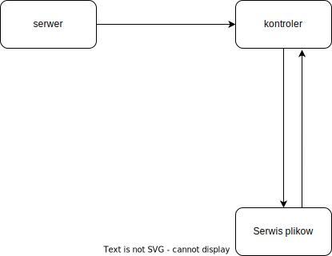

# SimpleHTTPServer
* Repozytorium z kodem aplikacji semestralnej z podstaw programowania 2. 
* Aplikacja przedstawia bardzo prosty serwer HTTP, który obsługuje zapytanie GET z body typu JSON i zwraca body JSON z kontentem pliku, który został podany w zapytaniu.

# Diagramy

---

